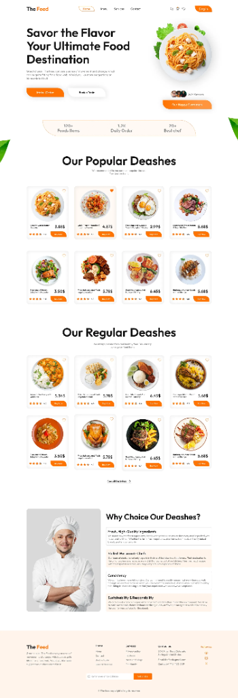
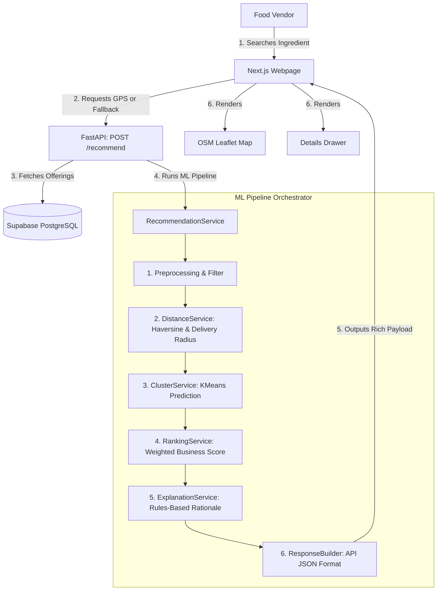
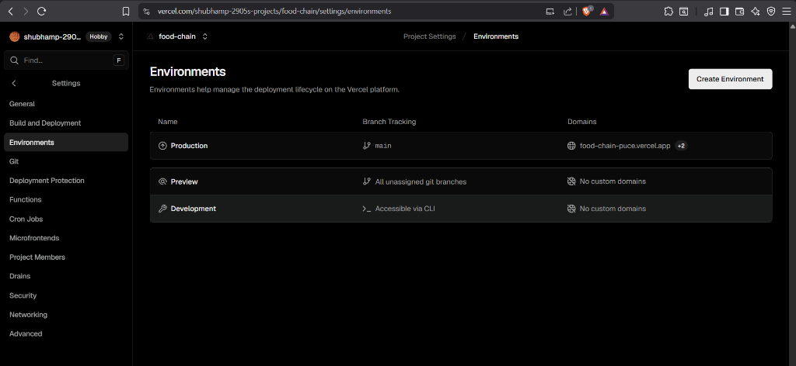
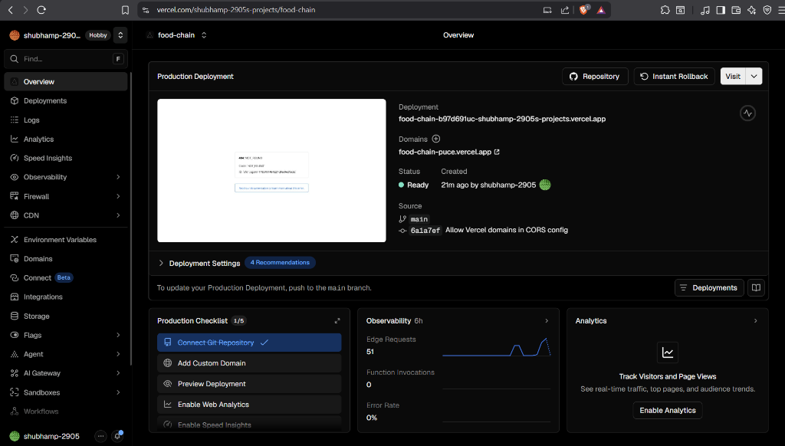
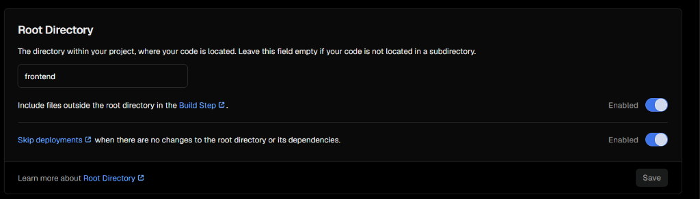

# 🥬 FoodChain AI — Smart Procurement for Street Food Vendors

<div align="center">
  
  
  <p align="center">
    <strong>An AI-powered procurement and supplier recommendation system helping street food vendors discover optimal raw material suppliers using Geolocation, K-Means Clustering, and Multi-Criteria Business Ranking.</strong>
  </p>

  <p align="center">
    <a href="https://github.com/shubhamp-2905/FoodChain/actions"></a>
    <a href="https://github.com/shubhamp-2905/FoodChain/blob/main/LICENSE"></a>
    <a href="https://github.com/shubhamp-2905/FoodChain/stargazers"></a>
  </p>
</div>

---

## 🌐 Live Demo

Experience the FoodChain AI platform live:

*   🖥️ **Frontend (Vercel):** [https://food-chain-puce.vercel.app](https://food-chain-puce.vercel.app)
*   ⚙️ **Backend API (Render):** [https://foodchain-i150.onrender.com/health](https://foodchain-i150.onrender.com/health)
*   📊 **API Documentation:** [https://foodchain-i150.onrender.com/docs](https://foodchain-i150.onrender.com/docs)

---

## 🏗️ Architecture

FoodChain AI is built as a highly decoupled, modern monorepo separating client logic, server logic, and machine learning pipelines.



---

## ✨ Features

*   📍 **Smart Geolocation recommendations:** Automatically searches nearby suppliers based on browser GPS or profile fallback coordinates.
*   🤖 **AI Supplier Segmentation:** Uses a pre-trained K-Means clustering model to classify suppliers into pricing and reliability cohorts.
*   ⚖️ **Multi-Criteria Ranking:** Ranks suppliers using a custom business-weighted formula (Distance 35%, Price 25%, Rating 15%, Quality 10%, Reliability 10%, Delivery 5%).
*   💬 **Natural Language Explanations:** Generates dynamic, rule-based textual reasons explaining why a supplier is recommended.
*   🗺️ **Interactive Leaflet Map:** Displays suppliers, delivery radius, and vendor location visually on an interactive map.
*   🌓 **Theme Customization & Profile Management:** Sleek dark/light modes and fully editable profile settings.

---

## 📸 Screenshots

### 📊 Vendor Analytics Dashboard
<div align="center">
  
</div>

### 🥬 Smart AI Recommendations & Leaflet Map
<div align="center">
  
</div>

### 🏢 Supplier Directory & Details Sheet
<div align="center">
  
</div>

---

## 🛠️ Tech Stack

*   **Frontend:** Next.js (App Router), React, TailwindCSS, Framer Motion, Axios, React Leaflet (OpenStreetMap)
*   **Backend:** FastAPI (Python), SQLAlchemy ORM, Alembic migrations, Uvicorn
*   **Database:** Supabase / PostgreSQL
*   **Machine Learning:** Scikit-Learn (K-Means, StandardScaler), Pandas, Joblib

---

## 📁 Folder Structure

```text
FoodChain/
│
├── backend/
│   ├── app/
│   │   ├── api/
│   │   │   └── recommendation.py       # FastAPI POST /recommend endpoint
│   │   ├── ml/
│   │   │   ├── core/
│   │   │   │   └── model_manager.py     # Thread-safe cached ML model manager
│   │   │   ├── services/
│   │   │   │   ├── recommendation_service.py # Orchestrator
│   │   │   │   ├── distance_service.py  # GPS math and delivery radius filtering
│   │   │   │   ├── cluster_service.py   # StandardScaler scaling and KMeans prediction
│   │   │   │   ├── ranking_service.py   # Business weighted ranking (0-100 score)
│   │   │   │   └── explanation_service.py # Rule-based deterministic text generator
│   │   │   ├── utils/
│   │   │   │   ├── haversine.py         # Distance math in kilometers
│   │   │   │   └── preprocessing.py     # Database ORM-to-dict mapper
│   │   │   ├── schemas/
│   │   │   │   └── recommendation.py    # Pydantic schemas (match score, confidence)
│   │   │   └── artifacts/               # Loaded K-Means and Scaler pickle files
│   │   │
│   │   └── repositories/
│   │       └── inventory_repository.py  # Joined supplier-product queries
│   │
│   ├── scripts/
│   │   ├── train_recommendation_model.py # Notebook programmatic training script
│   │   └── test_recommender.py          # CLI verified recommendations
│   └── tests/
│       └── test_recommendation_api.py   # HTTP validation and override tests
│
├── frontend/
│   ├── app/
│   │   └── (dashboard)/
│   │       └── recommendations/
│   │           ├── page.tsx             # Main page (autocomplete search, cards list)
│   │           ├── MapComponent.tsx     # Lazy-loaded OpenStreetMap React Leaflet map
│   │           └── SupplierDetailsDrawer.tsx # Detailed supplier statistics sheet
│   ├── components/                      # Reusable UI components
│   └── services/                        # Axios-based API services
│
├── notebooks/                           # Original ML development notebooks
└── data/                                # Puned supplier CSV datasets
```

---

## 🧠 ML Pipeline

The backend hosts a K-Means model trained on local Pune supplier parameters to segment distributors. The pipeline processes requests through these stages:

1.  **Ingredient Filtering:** Filters available database offerings to only those supplying the exact ingredient searched.
2.  **Proximity Math:** Computes the Haversine distance in kilometers from the vendor's GPS coordinates to each supplier.
3.  **Delivery Radius Filtering:** Excludes suppliers who are further away than their listed `delivery_radius_km`.
4.  **Feature Standard Scaling:** Scales features (`price`, `distance_km`, `rating`, `quality_score`, `reliability_score`, `average_delivery_time_min`) using the trained standard scaler.
5.  **K-Means Segment Assignment:** Predicts which optimized cluster the supplier belongs to.
6.  **Multi-Criteria Ranking:** Calculates a weighted score:
    *   **Distance (35%)**: lower is better
    *   **Price (25%)**: lower is better
    *   **Rating (15%)**: higher is better
    *   **Quality (10%)**: higher is better
    *   **Reliability (10%)**: higher is better
    *   **Delivery Speed (5%)**: lower is better
7.  **Match Conversion:** Maps the float score to an integer `match_score` (0-100) and categorizes confidence level:
    *   **High Match:** $\ge 80$
    *   **Medium Match:** $50 \le \text{Score} < 80$
    *   **Low Match:** $< 50$
8.  **Textual Explanation:** Generates a custom deterministic summary sentence highlighting key supplier selling points.

---

## 🔌 API Endpoints

### `POST /recommend`
Retrieve optimized recommendations. Authenticated session token is required in the header.

*   **Request Body:**
    ```json
    {
      "ingredient": "Potato",
      "latitude": 18.5204,
      "longitude": 73.8567
    }
    ```
    *(Note: If `latitude` and `longitude` are omitted, the engine automatically falls back to the user's stored profile coordinates.)*

*   **Response:**
    ```json
    {
      "ingredient": "Potato",
      "generated_at": "2026-06-26T06:01:06.944398+00:00",
      "best_supplier": {
        "id": 1,
        "supplier_id": "SUPP001",
        "supplier_name": "Sawant Agro Traders",
        "supplier_type": "Vegetable Wholesaler",
        "market": "Shivajinagar Market",
        "area": "Shivajinagar",
        "latitude": 18.5200,
        "longitude": 73.8560,
        "ingredient": "Potato",
        "category": "Vegetable",
        "price": 31.19,
        "unit": "kg",
        "stock_available": 500,
        "minimum_order": 10,
        "quality_score": 4.8,
        "rating": 4.8,
        "reliability_score": 95.0,
        "delivery_radius_km": 5.0,
        "distance_km": 0.58,
        "cluster": 1,
        "recommendation_score": 0.7337,
        "delivery_time": 18,
        "match_score": 73,
        "confidence": "Medium",
        "reason": "Recommended because it is the closest supplier and provides fast delivery times."
      },
      "alternatives": [
        {
          "id": 2,
          "supplier_id": "SUPP002",
          "supplier_name": "Annapurna Fresh Produce",
          "price": 34.50,
          "distance_km": 1.25,
          "match_score": 68,
          "confidence": "Medium"
        }
      ],
      "metadata": {
        "suppliers_checked": 16530,
        "eligible_suppliers": 228,
        "processing_time_ms": 152,
        "model_version": "1.0.0"
      }
    }
    ```

---

## 🚀 Future Scope

*   📈 **Demand Forecasting:** Predict vendor raw material sales trends based on day-of-week and seasonal factors.
*   📦 **Inventory Optimization:** Smart triggers alerting vendors when to reorder raw materials.
*   🤖 **AI Procurement Assistant:** Integrated LLM chatbot to resolve sourcing queries.
*   📊 **Smart Price Trends:** Predict local market price fluctuations for proactive budgeting.
