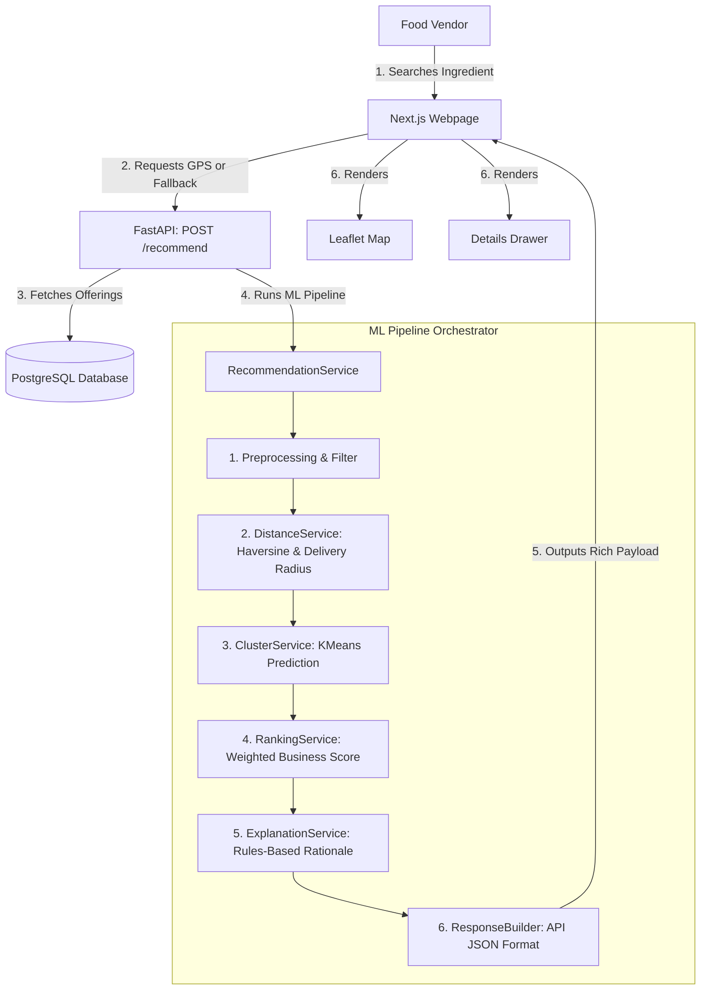

# FoodChain AI — Complete Supplier Recommendation System

An AI-powered procurement and supplier recommendation system tailored for street food vendors, helping them discover optimal raw material suppliers using Geolocation, K-Means Clustering, and Multi-Criteria Business Ranking.

---

## Folder Structure

```text
FoodChain/
│
├── backend/
│   ├── app/
│   │   ├── api/
│   │   │   └── recommendation.py       # FastAPI POST /recommend endpoint
│   │   ├── ml/
│   │   │   ├── core/
│   │   │   │   └── model_manager.py     # Thread-safe cached ML model manager
│   │   │   ├── services/
│   │   │   │   ├── recommendation_service.py # Orchestrator
│   │   │   │   ├── distance_service.py  # GPS math and delivery radius filtering
│   │   │   │   ├── cluster_service.py   # StandardScaler scaling and KMeans prediction
│   │   │   │   ├── ranking_service.py   # Business weighted ranking (0-100 score)
│   │   │   │   └── explanation_service.py # Rule-based deterministic text generator
│   │   │   ├── utils/
│   │   │   │   ├── haversine.py         # Distance math in kilometers
│   │   │   │   └── preprocessing.py     # Database ORM-to-dict mapper
│   │   │   ├── schemas/
│   │   │   │   └── recommendation.py    # Pydantic schemas (match score, confidence)
│   │   │   └── artifacts/               # Loaded K-Means and Scaler pickle files
│   │   │
│   │   └── repositories/
│   │       └── inventory_repository.py  # Joined supplier-product queries
│   │
│   ├── scripts/
│   │   ├── train_recommendation_model.py # Notebook programmatic training script
│   │   └── test_recommender.py          # CLI verified recommendations
│   └── tests/
│       └── test_recommendation_api.py   # HTTP validation and override tests
│
├── frontend/
│   └── app/
│       └── (dashboard)/
│           └── recommendations/
│               ├── page.tsx             # Main page (autocomplete search, cards list)
│               ├── MapComponent.tsx     # Lazy-loaded OpenStreetMap React Leaflet map
│               └── SupplierDetailsDrawer.tsx # Detailed supplier statistics sheet
│
├── notebooks/                           # Original ML development notebooks
└── data/                                # Puned supplier CSV datasets
```

---

## Database Schema

The database schema is fully normalized and implemented using SQLAlchemy:

### 1. `users` (Street Food Vendors)
* `id` (Integer, Primary Key)
* `full_name` (String, Required)
* `email` (String, Unique, Required)
* `hashed_password` (String, Required)
* `mobile_number` (String, Required)
* `business_name` (String, Required)
* `food_type` (String, Required)
* `latitude` (Float, Optional)
* `longitude` (Float, Optional)
* `area` (String, Optional)
* `city` (String, Optional)
* `state` (String, Optional)

### 2. `suppliers` (Raw Material Distributors)
* `id` (Integer, Primary Key)
* `supplier_id` (String, Unique, Required)
* `supplier_name` (String, Required)
* `supplier_type` (String, Required)
* `market` (String, Required)
* `area` (String, Required)
* `latitude` (Float, Required)
* `longitude` (Float, Required)
* `quality_score` (Float, Required)
* `rating` (Float, Required)
* `reliability_score` (Float, Required)
* `delivery_radius_km` (Float, Required)
* `average_delivery_time_min` (Integer, Required)

### 3. `products` (Ingredient Catalog)
* `id` (Integer, Primary Key)
* `ingredient` (String, Unique, Required)
* `category` (String, Required)
* `unit` (String, Required)

### 4. `supplier_inventories` (Supplier Stock & Offerings)
* `id` (Integer, Primary Key)
* `supplier_id` (Integer, ForeignKey('suppliers.id'))
* `product_id` (Integer, ForeignKey('products.id'))
* `price` (Float, Required)
* `stock_available` (Float, Required)
* `minimum_order` (Float, Required)

---

## System Architecture



---

## How Recommendation Works

1. **Ingredient Filtering**: Filters available database offerings to only those supplying the exact ingredient searched.
2. **Proximity Math**: Computes the Haversine distance in kilometers from the vendor's GPS coordinates to each supplier.
3. **Delivery Radius Filtering**: Excludes suppliers who are further away than their listed `delivery_radius_km`.
4. **Feature Standard Scaling**: Scales features (`price`, `distance_km`, `rating`, `quality_score`, `reliability_score`, `average_delivery_time_min`) using the trained standard scaler.
5. **K-Means Segment Assignment**: Predicts which optimized cluster the supplier belongs to.
6. **Multi-Criteria Ranking**: Calculates a weighted score:
   - **Distance (35%)**: lower is better
   - **Price (25%)**: lower is better
   - **Rating (15%)**: higher is better
   - **Quality (10%)**: higher is better
   - **Reliability (10%)**: higher is better
   - **Delivery Speed (5%)**: lower is better
7. **Match Conversion**: Maps the float score to an integer `match_score` (0-100) and categorizes confidence level:
   - **High Match**: $\ge 80$
   - **Medium Match**: $50 \le \text{Score} < 80$
   - **Low Match**: $< 50$
8. **Textual Explanation**: Generates a custom deterministic summary sentence highlighting key supplier selling points.

---

## API Reference

### POST `/recommend`

Retrieve optimized recommendations. Authenticated session token is required in the header.

**Request Body**:
```json
{
    "ingredient": "Potato",
    "latitude": 18.5204,
    "longitude": 73.8567
}
```
*Note: If `latitude` and `longitude` are omitted, the engine automatically falls back to the user's stored profile coordinates.*

**Response**:
```json
{
    "ingredient": "Potato",
    "generated_at": "2026-06-26T06:01:06.944398+00:00",
    "best_supplier": {
        "id": 1,
        "supplier_id": "SUPP001",
        "supplier_name": "Sawant Agro Traders",
        "supplier_type": "Vegetable Wholesaler",
        "market": "Shivajinagar Market",
        "area": "Shivajinagar",
        "latitude": 18.5200,
        "longitude": 73.8560,
        "ingredient": "Potato",
        "category": "Vegetable",
        "price": 31.19,
        "unit": "kg",
        "stock_available": 500,
        "minimum_order": 10,
        "quality_score": 4.8,
        "rating": 4.8,
        "reliability_score": 95.0,
        "delivery_radius_km": 5.0,
        "distance_km": 0.58,
        "cluster": 1,
        "recommendation_score": 0.7337,
        "delivery_time": 18,
        "match_score": 73,
        "confidence": "Medium",
        "reason": "Recommended because it is the closest supplier and provides fast delivery times."
    },
    "alternatives": [
        {
            "id": 2,
            "supplier_id": "SUPP002",
            "supplier_name": "Annapurna Fresh Produce",
            ...
        }
    ],
    "metadata": {
        "suppliers_checked": 16530,
        "eligible_suppliers": 228,
        "processing_time_ms": 1252,
        "model_version": "1.0.0"
    }
}
```

---

## Programmatic Model Retraining

The system includes a script to run feature extraction and train scikit-learn standard scaling and K-Means segmentation models directly from the jupyter notebook files.

1. Ensure the raw Pune supplier CSV is seeded at `data/pune_supplier_dataset.csv`.
2. Run the retraining script:
   ```bash
   python backend/scripts/train_recommendation_model.py
   ```
3. The script will execute the code blocks, apply the data fixes, output the pickle files in `backend/app/ml/artifacts/` and save `data/supplier_clustered.csv`.

---

## Launching E2E Suite

### Run Backend Tests
Ensure the python environment is activated and dependencies are installed.
```bash
cd backend
python -m unittest tests/test_recommendation_api.py
```

### Launch Development Server
1. Start backend FastAPI:
   ```bash
   cd backend
   uvicorn app.main:app --reload
   ```
2. Start frontend Next.js:
   ```bash
   cd frontend
   npm run dev
   ```
