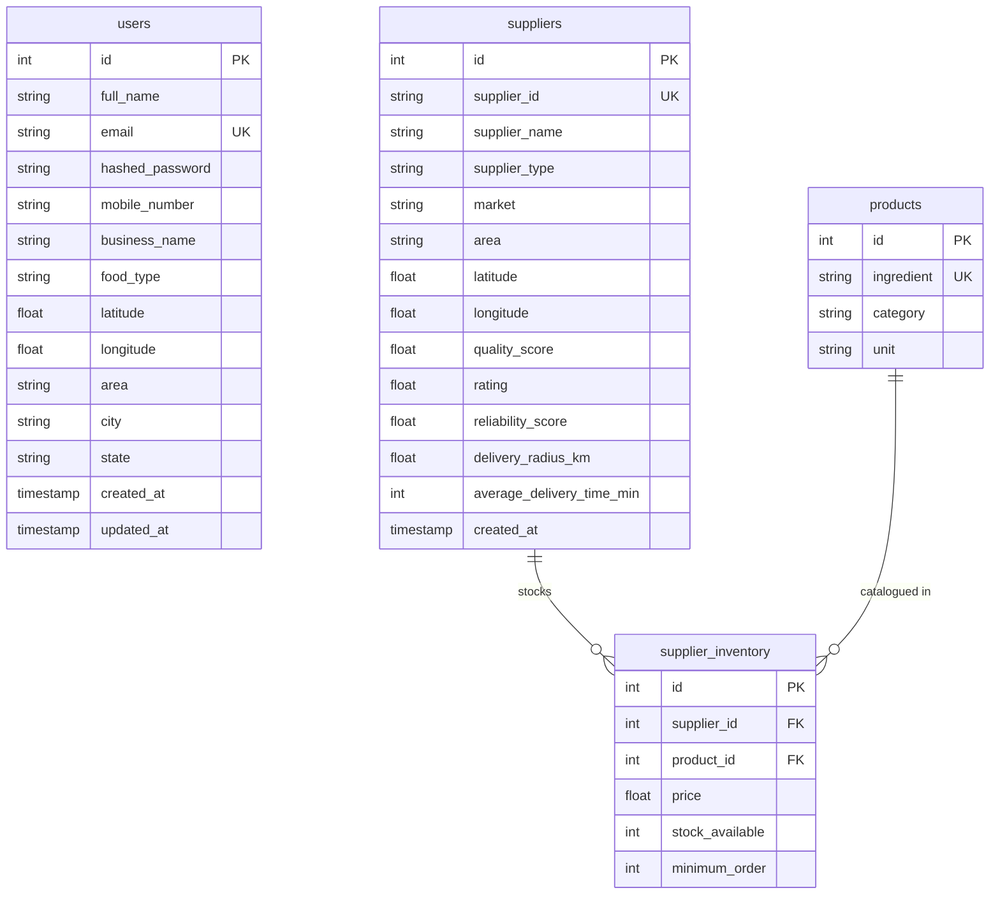
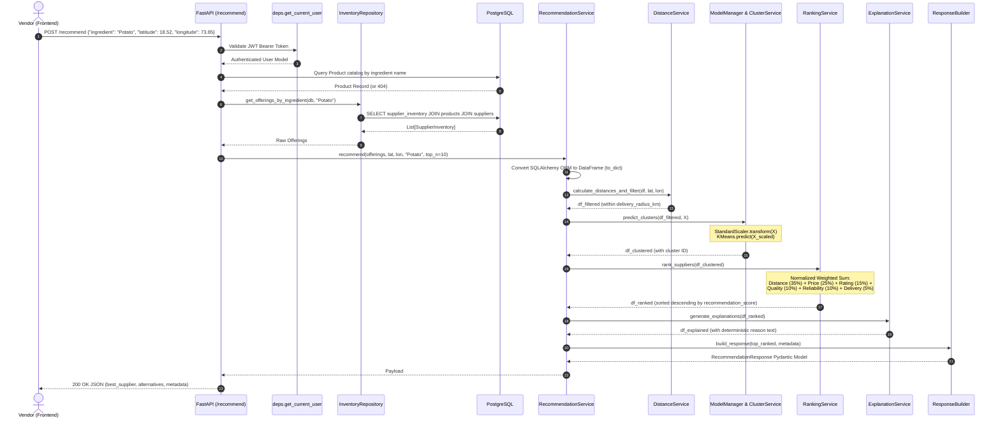

# FoodChain AI — Current Architecture Audit (Phase 0)

> **Document Status**: Production Baseline Audit  
> **Repository**: `FoodChain AI`  
> **Audited By**: Antigravity Data Platform Agent  
> **Date**: September 2026  
> **Phase**: Phase 0 — Comprehensive Repository Audit  

---

## 1. Executive Summary

**FoodChain AI** is an intelligent raw-material procurement and supplier recommendation system targeted at street-food vendors in Pune, India. Street-food vendors operate under extreme working capital and perishability constraints, requiring reliable raw materials (vegetables, dairy, spices, oils, packaging, grains) from proximate, cost-effective, and dependable suppliers.

The current system is functional and comprises:
1. A **FastAPI** REST backend serving supplier listings, product catalog, authentication, and recommendation logic.
2. A **PostgreSQL 16** operational database storing vendors (`users`), `suppliers`, `products`, and `supplier_inventory`.
3. An **offline ML pipeline** built in Jupyter Notebooks that trains a `StandardScaler` and a `KMeans` clustering model.
4. A **Next.js 16** (React 19, Tailwind CSS v4, Lucide icons, React Leaflet / OpenStreetMap) frontend dashboard.

This document establishes the verified baseline of the existing codebase prior to Phase 1–20 data engineering and platform upgrades.

---

## 2. Current End-to-End System Architecture

```mermaid
flowchart TD
    subgraph DataSources["Data Sources & Offline ML"]
        CSV["Raw Dataset: pune_supplier_dataset.csv (16,531 rows)"]
        NB2["notebooks/02_Feature_Engineering.ipynb"]
        NB3["notebooks/03_Model_Training.ipynb"]
        TrainScript["backend/scripts/train_recommendation_model.py (exec() on notebooks)"]
        Artifacts["Models & Artifacts: scaler.pkl, kmeans.pkl"]
    end

    subgraph StorageLayer["Operational Storage (PostgreSQL 16)"]
        DB[(PostgreSQL 16: foodchain_db)]
        T_Users[users]
        T_Suppliers[suppliers]
        T_Products[products]
        T_Inventory[supplier_inventory]
    end

    subgraph BackendAPI["Backend Service (FastAPI / Uvicorn)"]
        AuthMiddleware["JWT Authentication (deps.py)"]
        RouterRec["POST /recommend (recommendation.py)"]
        RepoInv["InventoryRepository"]
        RecService["RecommendationService (Orchestrator)"]
        DistService["DistanceService (Haversine)"]
        ModelMgr["ModelManager (Singleton Cache)"]
        ClusterService["ClusterService (KMeans Predict)"]
        RankingService["RankingService (Deterministic Weights)"]
        ExplanationService["ExplanationService (Rule-Based)"]
        RespBuilder["ResponseBuilder"]
    end

    subgraph ClientLayer["Frontend Application (Next.js 16 / React 19)"]
        NextApp["Next.js App Router (localhost:3000)"]
        MapComp["Leaflet Map Component"]
        RecUI["Recommendations Page (Cards & Badges)"]
        Drawer["SupplierDetailsDrawer"]
    end

    CSV --> TrainScript
    NB2 --> TrainScript
    NB3 --> TrainScript
    TrainScript --> Artifacts
    CSV -->|scripts/seed_database.py| DB
    DB --- T_Users
    DB --- T_Suppliers
    DB --- T_Products
    DB --- T_Inventory

    NextApp -->|HTTP POST /recommend with Bearer Token| AuthMiddleware
    AuthMiddleware --> RouterRec
    RouterRec --> RepoInv
    RepoInv -->|SQL Join Query| DB
    RepoInv --> RecService
    Artifacts --> ModelMgr
    ModelMgr --> ClusterService
    RecService --> DistService
    RecService --> ClusterService
    RecService --> RankingService
    RecService --> ExplanationService
    RecService --> RespBuilder
    RespBuilder --> RouterRec
    RouterRec --> NextApp
    NextApp --> MapComp
    NextApp --> RecUI
    NextApp --> Drawer
```



---

## 3. Current Data Flow & Storage

### 3.1 Data Ingestion & Seeding
* **Source Dataset**: [`data/pune_supplier_dataset.csv`](file:///d:/Projects/Foodchain/data/pune_supplier_dataset.csv) containing 16,531 raw supplier-product offering records across 18 columns.
* **Seeding Mechanism**: [`backend/app/db/seed.py`](file:///d:/Projects/Foodchain/backend/app/db/seed.py) executed via [`backend/scripts/seed_database.py`](file:///d:/Projects/Foodchain/backend/scripts/seed_database.py) or during container startup in [`backend/entrypoint.sh`](file:///d:/Projects/Foodchain/backend/entrypoint.sh).
* **Ingestion Logic**:
  - Checks if `suppliers` table contains records; skips if populated.
  - Groups unique suppliers in-memory using `supplier_id` as business key.
  - Groups unique products in-memory using composite tuple `(ingredient, category, unit)`.
  - Normalizes and inserts records into `suppliers`, `products`, then performs a `db.flush()` to obtain autoincremented IDs.
  - Links offerings into `supplier_inventory` linking `supplier_id` and `product_id`.

### 3.2 Operational Database Model (PostgreSQL)
The relational schema is configured in [`backend/app/models/`](file:///d:/Projects/Foodchain/backend/app/models/) and managed via Alembic revision [`001_initial_migration.py`](file:///d:/Projects/Foodchain/backend/alembic/versions/001_initial_migration.py):

| Table Name | Primary Key | Foreign Keys | Indexed Columns | Description |
| :--- | :--- | :--- | :--- | :--- |
| `users` | `id` (SERIAL) | None | `email` (UNIQUE) | Street-food vendor profiles, auth password hash, and default GPS coordinates (`latitude`, `longitude`). |
| `suppliers` | `id` (SERIAL) | None | `supplier_id` (UNIQUE), `area`, `supplier_type` | Supplier operational master data, coordinates, reliability metrics, and delivery limits. |
| `products` | `id` (SERIAL) | None | `ingredient` (UNIQUE), `category` | Normalized ingredient catalog (`ingredient`, `category`, `unit`). |
| `supplier_inventory` | `id` (SERIAL) | `supplier_id` &rarr; `suppliers.id`, `product_id` &rarr; `products.id` | `supplier_id`, `product_id` | Join table storing supplier offerings, stock levels, unit prices, and MOQ. |



---

## 4. Current Machine Learning Pipeline & Inference Flow

### 4.1 Offline Training Architecture
The existing model training relies on Jupyter Notebooks in [`notebooks/`](file:///d:/Projects/Foodchain/notebooks/):
1. **Feature Engineering** ([`02_Feature_Engineering.ipynb`](file:///d:/Projects/Foodchain/notebooks/02_Feature_Engineering.ipynb)):
   - Loads `data/pune_supplier_dataset.csv`.
   - Simulates a fixed reference vendor coordinate `(18.5204, 73.8567)`.
   - Computes Haversine distance and filters records where `distance_km <= delivery_radius_km`.
   - Selects 6 features: `price`, `distance_km`, `rating`, `quality_score`, `reliability_score`, `average_delivery_time_min`.
   - Fits a `StandardScaler` and dumps it to `models/scaler.pkl`.
   - Exports scaled features to `data/processed_features.csv`.
2. **Model Training** ([`03_Model_Training.ipynb`](file:///d:/Projects/Foodchain/notebooks/03_Model_Training.ipynb)):
   - Computes Elbow Inertia and Silhouette scores across $k \in [2, 10]$.
   - Fits `KMeans(n_clusters=best_k, random_state=42, n_init=10)`.
   - Saves model to `models/kmeans_model.pkl` and clusters to `data/supplier_clustered.csv`.
3. **Execution Script** ([`backend/scripts/train_recommendation_model.py`](file:///d:/Projects/Foodchain/backend/scripts/train_recommendation_model.py)):
   - Loads JSON notebooks and dynamically executes code strings via `exec()`.
   - Injects mock objects into `sys.modules['matplotlib']`.
   - Copies generated `.pkl` files from `models/` into `backend/app/ml/artifacts/`.

### 4.2 Online Inference Pipeline
When a client triggers `POST /recommend`:



---

## 5. Current API Surface

| Method | Path | Auth Required | Description | Request Schema | Response Schema |
| :--- | :--- | :---: | :--- | :--- | :--- |
| `GET` | `/` | No | Health check | None | `{"status": "healthy", ...}` |
| `GET` | `/health` | No | Detailed health status | None | `{"status": "healthy", ...}` |
| `POST` | `/auth/register` | No | Register vendor | `RegisterRequest` | `AuthResponse` |
| `POST` | `/auth/login` | No | Vendor authentication | `LoginRequest` | `AuthResponse` |
| `GET` | `/profile` | Yes | Get vendor profile | None | `UserProfileResponse` |
| `PUT` | `/profile` | Yes | Update vendor profile | `UpdateProfileRequest` | `UserProfileResponse` |
| `PUT` | `/profile/password` | Yes | Update password | `ChangePasswordRequest`| `UserProfileResponse` |
| `GET` | `/ingredients` | Yes | List unique ingredient names | None | `List[str]` |
| `GET` | `/products` | Yes | Search & filter products | Query params: `search`, `category` | `List[ProductResponse]` |
| `GET` | `/suppliers` | Yes | Paginated supplier search | Query: `search`, `area`, `page`, etc. | `PaginatedSupplierResponse` |
| `GET` | `/suppliers/{id}` | Yes | Detailed supplier info | Path param `id` | `SupplierResponse` |
| `POST` | `/recommend` | Yes | AI supplier recommendations | `RecommendationRequest` | `RecommendationResponse` |

---

## 6. Current Testing Strategy & Verification

The existing automated test suite is housed in [`backend/tests/test_recommendation_api.py`](file:///d:/Projects/Foodchain/backend/tests/test_recommendation_api.py).  
Execution via `python -m unittest discover -s backend/tests` reveals:
* **Total Tests**: 6
* **Status**: 6 Passing (0 failures, 0 errors, duration: 5.3s)
* **Test Focus**:
  1. `test_recommend_success`: Full mocked execution of `/recommend`.
  2. `test_recommend_coordinate_fallback`: Profile coordinate fallback when request coordinates are omitted.
  3. `test_recommend_missing_gps_error`: HTTP 400 validation on missing GPS.
  4. `test_recommend_invalid_coords_error`: HTTP 400 validation on out-of-range latitude/longitude.
  5. `test_recommend_ingredient_not_found_error`: HTTP 404 validation for uncatalogued ingredients.
  6. `test_model_manager_caches_models`: Singleton verification of cached ML model instances in memory.

---

## 7. Identified Technical Debt & Architectural Gaps

An exhaustive audit of the entire repository reveals the following critical gaps:

```text
+--------------------------------------------------------------------------------------------------+
|                                    IDENTIFIED GAPS & DEFECTS                                     |
+==================================================================================================+
|  CATEGORY         | DEFECT / DEBT                                               | IMPACT         |
|-------------------+-------------------------------------------------------------+----------------|
| ML Pipeline       | exec() execution of Jupyter Notebooks in training script     | Critical       |
| Data Integrity    | Missing database CHECK constraints and composite indexes    | High           |
| Reliability       | Hardcoded Windows file path (backend_auth.log) in deps.py   | High           |
| Pipeline Design   | Lack of modular Bronze/Silver/Gold data layers              | Critical       |
| Data Quality      | No quarantine table or automated rejection reporting        | High           |
| ML Theory         | Distance feature leakage during offline StandardScaler fit   | High           |
| Database Query    | Potential N+1 query issue in InventoryRepository            | Medium         |
| Observability     | No recommendation audit log table or request tracing ID     | Medium         |
| CI/CD & Deploy    | Missing CI/CD workflows and root container execution        | Medium         |
+--------------------------------------------------------------------------------------------------+
```

### Detailed Breakdown:
1. **Brittle Model Training**: [`backend/scripts/train_recommendation_model.py`](file:///d:/Projects/Foodchain/backend/scripts/train_recommendation_model.py) parses raw `.ipynb` JSON and calls Python's `exec()` in global scope while mocking `matplotlib`. Training cannot be parameterized, logged, or tested cleanly.
2. **Hardcoded Windows Path in Production Code**: [`backend/app/api/deps.py`](file:///d:/Projects/Foodchain/backend/app/api/deps.py#L37-L64) contains `open("d:/Projects/Foodchain/backend_auth.log", "a")` directly in the JWT auth flow, which causes file I/O failures or silent exceptions in Docker Linux environments.
3. **Database Constraints & Indexing**:
   - `supplier_inventory` has no composite unique index on `(supplier_id, product_id)`, risking duplicate offerings.
   - Missing SQL `CHECK` constraints on numeric ranges (`price > 0`, `rating BETWEEN 0 AND 5`, coordinates within $[-90, 90]$ and $[-180, 180]$).
   - `InventoryRepository.get_offerings_by_ingredient` executes `.join(Product).join(Supplier)` but does not use eager loading options (`joinedload` / `selectinload`), causing lazy queries during attribute extraction in `to_dict()`.
4. **Duplicate Logic**:
   - [`backend/app/ml/utils/preprocessing.py`](file:///d:/Projects/Foodchain/backend/app/ml/utils/preprocessing.py) defines `preprocess_offerings`, but [`recommendation_service.py`](file:///d:/Projects/Foodchain/backend/app/ml/services/recommendation_service.py) duplicates the exact same distance calculation and feature extraction in its main loop.
   - Duplicated model directories: `models/` vs `backend/app/ml/artifacts/`.
   - Obsolete backward-compatibility file: `backend/app/ml/services/recommender.py`.
5. **No Data Quality & Quarantine Framework**:
   - Invalid CSV records are either rejected during type casting or silently ignored; there is no structured quarantine dataset or quality pass/fail summary report.
6. **Lack of Recommendation Auditability & Observability**:
   - Recommendations are generated ephemerally; there is no audit log recording `request_id`, user ID, candidate count, selected supplier, or latency metrics for analytics.
7. **Feature Interaction Leakage**:
   - `StandardScaler` was fitted offline on `distance_km` calculated from a single arbitrary vendor GPS coordinate in Pune `(18.5204, 73.8567)`. In online inference, distance depends on the actual user coordinates, which distorts cluster assignments if a vendor is far from city center.

---

## 8. Conclusion

The current system has a clean architectural foundation with clear separations between API routes, repositories, and recommendation logic. However, transitioning it into an enterprise-grade platform requires transforming the ad-hoc notebook workflows into an automated Bronze/Silver/Gold pipeline, adding rigorous data validation and quarantine handling, optimizing database access, decoupling ML segmentation from deterministic scoring, and introducing comprehensive observability.
