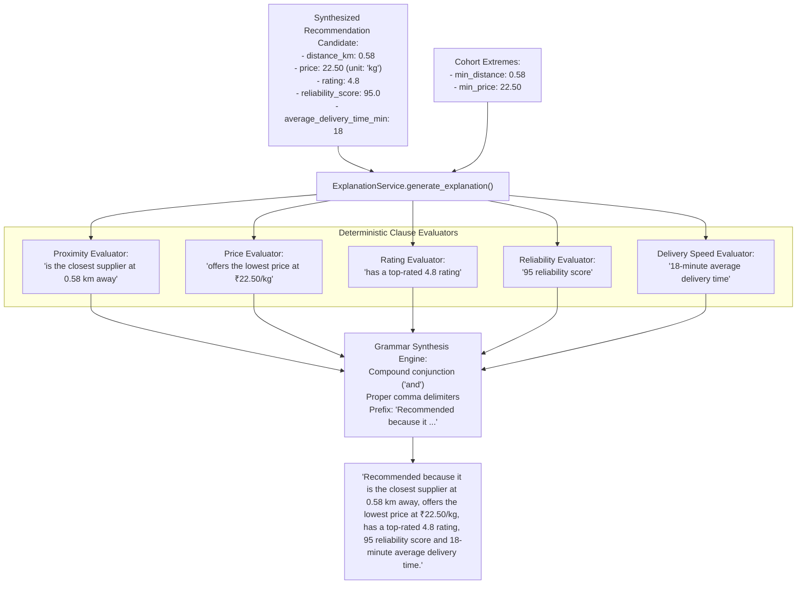

# FoodChain AI — Deterministic Explainability (Phase 9)

## 1. Executive Summary

Phase 9 upgrades the recommendation explanation mechanism from static or generic text generation to an enterprise-grade, **deterministic, data-backed explainability engine**.

### 1.1 Problem Statement & Anti-Patterns
In many modern AI prototypes, natural language explanations suffer from two common flaws:
1. **Generic Placeholders**: Phrases like *"Recommended because it matches your parameters"* or *"Recommended because it is good"*, which provide zero actionable insight to street-food vendors.
2. **Generative / LLM Hallucinations**: Deploying large language models (LLMs) to generate explanations introduces latency (often 500ms – 2000ms), external API costs, non-deterministic phrasing, and high risk of hallucinating facts (e.g. inventing delivery speeds or discounts that do not exist in the database).

### 1.2 The Phase 9 Solution
Phase 9 enforces strict **Deterministic Explainability**:
* **100% Value-Grounded**: Every clause cites verified quantitative values from the pipeline (exact distance in km, unit price with currency symbol and unit, numerical rating, reliability score, and delivery lead time).
* **Deterministic & Explainable**: Rule-based grammar synthesis guarantees identical outputs for identical data vectors with zero latency overhead (< 1ms execution time).
* **Zero External Dependencies**: Operates entirely within the core Python runtime with zero LLM API calls.
* **Context-Aware Superlatives**: Intelligently highlights competitive advantages (e.g., *closest supplier*, *lowest price in cohort*) relative to the active candidate pool.

---

## 2. Explanation Architecture



---

## 3. Clause Construction Rules

| Metric | Condition | Formatted Clause Example |
| :--- | :--- | :--- |
| **Distance (`distance_km`)** | Matches cohort minimum | `is the closest supplier at 0.58 km away` |
| | $< 1.0\text{ km}$ | `is only 0.85 km away` |
| | General | `is 2.40 km away` |
| **Price (`price`, `unit`)** | Matches cohort minimum | `offers the lowest price at ₹18.00/kg` |
| | General | `offers a price of ₹22.50/kg` |
| **Rating (`rating`)** | $\ge 4.8$ | `has a top-rated 4.8 rating` |
| | General | `has a 4.2 rating` |
| **Reliability (`reliability_score`)** | General | `95 reliability score` |
| **Fulfillment (`average_delivery_time_min`)** | General | `18-minute average delivery time` |

### Compound Grammar Rules:
* **1 Clause:** `"Recommended because it {clause}."`
* **2 Clauses:** `"Recommended because it {clause1} and {clause2}."`
* **3+ Clauses:** `"Recommended because it {clause1}, {clause2} ... and {clauseN}."`

---

## 4. Structured Factor Breakdown

In addition to the natural language sentence, [`ExplanationService.extract_explanation_factors()`](file:///d:/Projects/Foodchain/backend/app/ml/services/explanation_service.py) generates structured key-value factor descriptors for rich frontend UI badges:

```json
[
  {
    "factor": "proximity",
    "label": "Distance",
    "value": "0.58 km",
    "is_best": true
  },
  {
    "factor": "price",
    "label": "Unit Price",
    "value": "₹22.50/kg",
    "is_best": true
  },
  {
    "factor": "rating",
    "label": "Rating",
    "value": "4.8/5.0",
    "is_best": true
  },
  {
    "factor": "reliability",
    "label": "Reliability Score",
    "value": "95/100",
    "is_best": true
  },
  {
    "factor": "delivery_time",
    "label": "Fulfillment Speed",
    "value": "18 mins",
    "is_best": true
  }
]
```

---

## 5. Automated Verification & Testing

The dedicated test suite [`backend/tests/test_explanation_service.py`](file:///d:/Projects/Foodchain/backend/tests/test_explanation_service.py) guarantees:

1. **Numerical Grounding**: Asserts presence of exact numbers matching input attributes.
2. **Superlatives**: Verifies that minimum distance and minimum price in a candidate cohort trigger comparative superlatives.
3. **Pure Determinism**: 100 consecutive invocations on identical data yield 100% bitwise identical output strings.
4. **Grammatical Accuracy**: Verifies correct comma and conjunction assembly for 1, 2, 3, or more clauses.
5. **Null Safety & Resilience**: Handles sparse rows and empty DataFrames without exceptions.

```bash
pytest backend/tests/test_explanation_service.py
# 8 passed in 3.12s

pytest backend/tests
# 53 passed in 5.54s (All 8 test suites passing)
```
