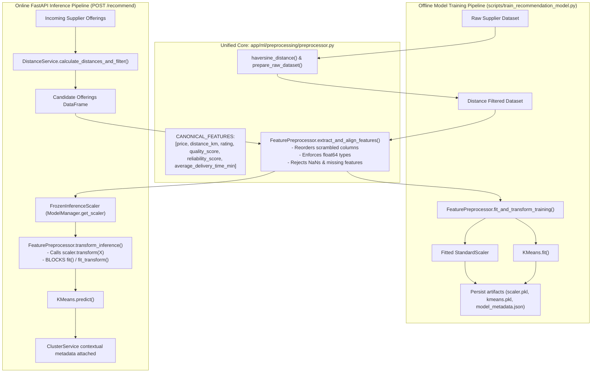

# FoodChain AI — Consistent Training & Inference Preprocessing (Phase 8)

## 1. Executive Summary

Phase 8 eliminates **training-serving skew** between offline machine learning model training and online FastAPI recommendation serving.

In machine learning systems, training-serving skew is one of the most subtle yet catastrophic failure modes. It occurs when features are engineered, ordered, or transformed differently between the offline training script and runtime inference APIs. Common causes include:
* **Feature Column Transposition**: Inadvertent column reordering in DataFrames when passing arrays into non-named numpy transforms.
* **Accidental Refitting**: Runtime services calling `.fit()` or `.fit_transform()` on a cached scaler during inference, causing memory weights to drift based on small request batches.
* **Code Duplication**: Independent distance calculations, coordinate logic, or feature extractions across disparate scripts and services.

Phase 8 introduces:
1. **Unified Feature Preprocessor** ([`FeaturePreprocessor`](file:///d:/Projects/Foodchain/backend/app/ml/preprocessing/preprocessor.py)): A single, authoritative preprocessing engine shared identically by both the offline training CLI ([`train_recommendation_model.py`](file:///d:/Projects/Foodchain/backend/scripts/train_recommendation_model.py)) and online serving services ([`ClusterService`](file:///d:/Projects/Foodchain/backend/app/ml/services/cluster_service.py) and [`RecommendationService`](file:///d:/Projects/Foodchain/backend/app/ml/services/recommendation_service.py)).
2. **Frozen Inference Scaler** ([`FrozenInferenceScaler`](file:///d:/Projects/Foodchain/backend/app/ml/preprocessing/preprocessor.py)): A read-only subclass of `StandardScaler` that allows `.transform()` but strictly raises `RuntimeError` if `.fit()`, `.fit_transform()`, or `.partial_fit()` is invoked at runtime.
3. **Canonical Feature Contract**: Strict enforcement of feature column ordering and type validation aligned with [`model_metadata.json`](file:///d:/Projects/Foodchain/backend/app/ml/artifacts/model_metadata.json).
4. **Comprehensive Automated Skew Testing** ([`test_inference_preprocessing.py`](file:///d:/Projects/Foodchain/backend/tests/test_inference_preprocessing.py)): Verifying bit-for-bit numerical parity and guardrail enforcement.

---

## 2. Architecture & Data Flow



---

## 3. Core Components

### 3.1 Feature Alignment & Validation Contract
The canonical feature vector consists of six numerical features:
```python
CANONICAL_FEATURES = [
    "price",
    "distance_km",
    "rating",
    "quality_score",
    "reliability_score",
    "average_delivery_time_min",
]
```
`FeaturePreprocessor.extract_and_align_features` provides:
* **Order Guarantee**: Irrespective of the column ordering in the source DataFrame or presence of extraneous metadata columns (e.g., `supplier_id`, `market`, `unit`), the resulting DataFrame columns match `CANONICAL_FEATURES` precisely.
* **Null Rejection**: Any candidate row containing `NaN` or unparseable values is intercepted with a clear `ValueError`, preventing silent failure or corrupted numerical inputs to scikit-learn.
* **Precision Casting**: Guarantees numeric coercion to `np.float64`.

### 3.2 The Frozen Inference Scaler (`FrozenInferenceScaler`)
To fulfill the requirement to **prevent accidental refitting during inference**, `ModelManager` caches an instance of `FrozenInferenceScaler`.

```python
class FrozenInferenceScaler(StandardScaler):
    """
    Read-only subclass of StandardScaler for online inference.
    Strictly permits .transform() and attribute access.
    Raises RuntimeError if .fit(), .fit_transform(), or .partial_fit() is called.
    """
    def fit(self, *args, **kwargs):
        raise RuntimeError("Accidental refitting prevented: Scaler is frozen for online inference.")

    def fit_transform(self, *args, **kwargs):
        raise RuntimeError("Accidental refitting prevented: Scaler is frozen for online inference.")

    def partial_fit(self, *args, **kwargs):
        raise RuntimeError("Accidental refitting prevented: Scaler is frozen for online inference.")
```

**Key Advantages:**
* Inherits from `StandardScaler`, ensuring 100% type compatibility (`isinstance(scaler, StandardScaler) == True`).
* Guards memory-resident weights against accidental mutation during HTTP request handling.
* Unfitted scalers cannot be wrapped, failing fast at application boot time.

---

## 4. Empirical Parity & Automated Verification

Automated test suite [`backend/tests/test_inference_preprocessing.py`](file:///d:/Projects/Foodchain/backend/tests/test_inference_preprocessing.py) validates the following properties:

| Test Case | Objective | Result |
| :--- | :--- | :---: |
| `test_feature_column_order_alignment` | Validates that scrambled columns are re-aligned to canonical order without data corruption. | **PASS** |
| `test_zero_training_serving_skew` | Asserts bit-for-bit numerical equality between training transforms and inference transforms ($\Delta \le 10^{-14}$) and 100% cluster prediction agreement. | **PASS** |
| `test_accidental_refit_prevention_on_frozen_scaler` | Confirms that invoking `.fit()`, `.fit_transform()`, or `.partial_fit()` on the inference scaler raises `RuntimeError`. | **PASS** |
| `test_unfitted_scaler_rejection` | Confirms that an unfitted `StandardScaler` cannot be wrapped or executed for inference. | **PASS** |
| `test_missing_feature_column_raises_error` | Confirms that omitted required features produce explicit `ValueError` naming the missing column. | **PASS** |
| `test_nan_value_detection` | Confirms that NaN values in features are blocked before scaling. | **PASS** |
| `test_non_numeric_coercion_and_validation` | Confirms string numbers are coerced while unparseable strings raise errors. | **PASS** |
| `test_metadata_feature_contract_conformance` | Confirms that `model_metadata.json` features match `CANONICAL_FEATURES`. | **PASS** |
| `test_cluster_service_uses_frozen_scaler_and_aligned_features` | Confirms end-to-end integration inside `ClusterService` preserves indices and immutability. | **PASS** |

### Test Suite Execution Summary
```bash
pytest backend/tests/test_inference_preprocessing.py
# 9 passed in 2.92s

pytest backend/tests
# 45 passed in 5.22s (100% passing across all 7 test suites)
```
