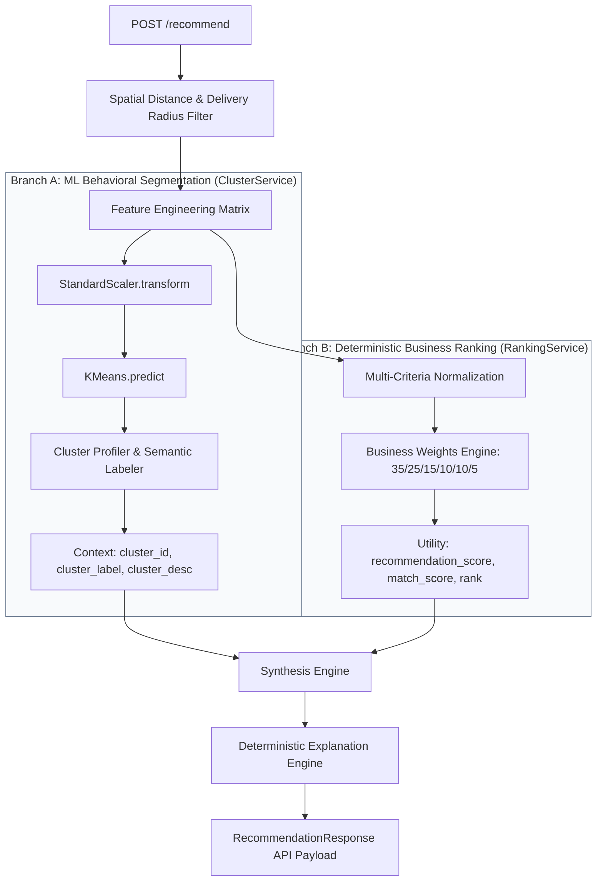

# FoodChain AI — Decoupled ML Segmentation & Business Ranking (Phase 6)

## 1. Executive Summary & Architectural Principle

Phase 6 resolves a critical conceptual ambiguity present in many machine learning systems: **conflating unsupervised clustering with business decision making**.

In early iterations of recommendation systems, clustering models (such as K-Means) are frequently mischaracterized as determining "which supplier is best." In enterprise data engineering and production AI architectures, this is an anti-pattern:
* **Unsupervised Clustering (K-Means)** is designed for **behavioral segmentation and contextual profiling**. It discovers latent groupings among suppliers based on operational characteristics (e.g., premium fast fulfillment vs. budget bulk supply). It has no concept of vendor preference, business margin, or user utility.
* **The Business Ranking Engine** is a **deterministic, multi-criteria decision model**. It evaluates candidate suppliers against explicit business priorities (delivery proximity, price competitiveness, quality rating, and fulfillment speed) to compute normalized match scores and establish recommendation rank.

Phase 6 refactors the recommendation pipeline into an explicit **Two-Branch Architecture**:

```text
                  Feature Engineering
                           │
                   ┌───────┴───────┐
                   ▼               ▼
                K-Means       Business Ranking
                   │               │
                   ▼               ▼
             Cluster Assignment  Weighted Score
                   │               │
                   └───────┬───────┘
                           ▼
                  Final Recommendation
```

---

## 2. Architecture Specification

### 2.1 Complete Recommendation Data Flow



---

## 3. Branch A: ML Behavioral Segmentation

Implemented in [`ClusterService`](file:///d:/Projects/Foodchain/backend/app/ml/services/cluster_service.py).

### 3.1 Responsibilities
* Accepts the preprocessed feature matrix $X$ covering 6 operational dimensions:
  1. `price`
  2. `distance_km`
  3. `rating`
  4. `quality_score`
  5. `reliability_score`
  6. `average_delivery_time_min`
* Applies `StandardScaler.transform()` using pre-fitted parameters (guaranteeing zero re-fitting at inference).
* Predicts discrete cluster assignments via `KMeans.predict()`.
* Maps numeric cluster IDs to semantic behavioral labels and operational descriptions.

### 3.2 Cluster Profiles (Derived from Training Centroids)

Analysis of the model centroids reveals two clear behavioral segments in the Pune supplier ecosystem:

| Cluster | Price (INR) | Distance (km) | Reliability (%) | Delivery Time (min) | Behavioral Profile Label | Operational Context |
| :---: | :---: | :---: | :---: | :---: | :--- | :--- |
| **0** | ~169.10 | ~5.29 km | **94.5%** | **18.7 min** | **Premium & Rapid Delivery Wholesaler** | High reliability with expedited fulfillment under 20 minutes; ideal for peak rush-hour orders. |
| **1** | **~138.60** | **~4.47 km** | 83.6% | 36.0 min | **Cost-Effective Standard Wholesaler** | Lower unit pricing with standard delivery lead times; ideal for planned morning inventory restocking. |

### 3.3 Isolation Guarantee
`ClusterService.segment_suppliers()` preserves input row indexing and order identically. It produces no scores and has **zero influence** over which candidate is ranked first or last.

---

## 4. Branch B: Deterministic Business Ranking Engine

Implemented in [`RankingService`](file:///d:/Projects/Foodchain/backend/app/ml/services/ranking_service.py) and [`ranking.py`](file:///d:/Projects/Foodchain/backend/app/ml/utils/ranking.py).

### 4.1 Multi-Criteria Utility Formulation
Each candidate supplier is scored using normalized utility dimensions:

$$\text{recommendation\_score} = \sum_{i=1}^{6} w_i \cdot s_i$$

Where weights and normalizations are explicitly defined:

| Metric | Direction | Normalization Formula | Business Weight ($w_i$) |
| :--- | :---: | :--- | :---: |
| **Distance** | Lower is better | $1.0 - \left(\frac{\text{distance\_km}}{\max(\text{distance\_km})}\right)$ | **35%** |
| **Price** | Lower is better | $1.0 - \left(\frac{\text{price}}{\max(\text{price})}\right)$ | **25%** |
| **Rating** | Higher is better | $\frac{\text{rating}}{5.0}$ | **15%** |
| **Quality** | Higher is better | $\frac{\text{quality\_score}}{5.0}$ | **10%** |
| **Reliability** | Higher is better | $\frac{\text{reliability\_score}}{100.0}$ | **10%** |
| **Delivery Time** | Lower is better | $1.0 - \left(\frac{\text{delivery\_time}}{\max(\text{delivery\_time})}\right)$ | **5%** |

### 4.2 Deterministic Sorting & Rank Assignment
Candidates are sorted descending by:
1. `recommendation_score` (descending primary key)
2. `rating` (descending secondary tie-breaker)
3. `distance_km` (ascending tertiary tie-breaker)

Each candidate is then assigned an explicit, 1-indexed integer `rank` ($1, 2, \dots, N$).

---

## 5. Synthesis & API Integration

In [`RecommendationService._synthesize_branches`](file:///d:/Projects/Foodchain/backend/app/ml/services/recommendation_service.py#L52-L68):
1. **Ranking Order Preservation**: The row sequence from Branch B is strictly preserved.
2. **Context Enrichment**: The cluster metadata (`cluster`, `cluster_label`, `cluster_desc`) from Branch A is attached to each ranked row by DataFrame index alignment.
3. **Public API Schema ([`SupplierRecommendation`](file:///d:/Projects/Foodchain/backend/app/ml/schemas/recommendation.py))**:
   - `rank`: Rank position (1 is best).
   - `match_score`: Scaled percentage $[0, 100]$.
   - `confidence`: Qualitative confidence classification (`"High"`, `"Medium"`, `"Low"`).
   - `cluster`: Discrete integer cluster ID.
   - `cluster_label`: Human-readable profile name (e.g. `"Premium & Rapid Delivery Wholesaler"`).
   - `reason`: Deterministic text explanation from [`ExplanationService`](file:///d:/Projects/Foodchain/backend/app/ml/services/explanation_service.py).

---

## 6. Automated Verification & Testing

A dedicated test suite in [`backend/tests/test_recommendation_logic_separation.py`](file:///d:/Projects/Foodchain/backend/tests/test_recommendation_logic_separation.py) enforces architectural separation:

1. **`test_branch_a_ml_segmentation_isolation`**: Confirms `ClusterService` preserves input length, preserves row order, assigns `cluster` and `cluster_label`, and does not compute `recommendation_score` or `rank`.
2. **`test_branch_b_business_ranking_isolation`**: Confirms `RankingService` operates without any cluster inputs, outputs strictly descending `recommendation_score`, and assigns 1-indexed `rank`.
3. **`test_cluster_assignment_does_not_affect_rank_or_score`**: Inverts cluster assignments ($0 \leftrightarrow 1$) on identical candidate data and proves that `recommendation_score` and `rank` remain 100% identical.
4. **`test_synthesis_merges_context_without_distorting_rank`**: Asserts that `_synthesize_branches` preserves the ranking order from Branch B while attaching cluster context from Branch A.
5. **`test_ranking_weights_distribution`**: Validates the numerical precision of the 35/25/15/10/10/5 business weighting formula.

**Test Suite Status**: **32/32 tests passing** across the backend.
