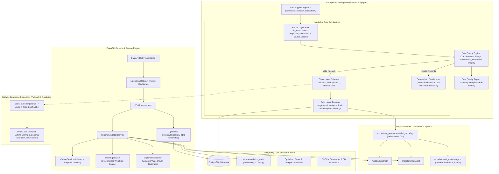

# FoodChain AI — Production Upgrade Plan (Phase 1 – 20)

> **Document Status**: Strategic Architecture & Roadmap  
> **Repository**: `FoodChain AI`  
> **Prepared By**: Antigravity Data Platform Agent  
> **Date**: September 2026  
> **Target Alignment**: Data Engineering + AI Platform Architecture  

---

## 1. Upgrade Objectives & Engineering Principles

The primary objective is to evolve the functional FoodChain AI prototype into a production-grade, enterprise-ready **Data Engineering + AI Platform**. 

### Core Engineering Principles:
1. **No Conceptual Deception**: Only document features that are verifiably implemented in code or explicitly labeled as architectural extensions.
2. **Preserve Application Behavior**: The core functionality of the FastAPI backend and Next.js frontend must continue to operate flawlessly while underlying pipelines are modernized.
3. **Decoupled Architecture**: Strictly separate data ingestion, feature transformation, model training, business ranking, and API serving into modular components.
4. **Deterministic & Explainable**: Business decisions must rely on transparent mathematical scoring and deterministic logic rather than opaque generative heuristics.
5. **Demonstrable Quality**: Every phase must provide automated tests, verifiable CLI entry points, and measurable benchmarks.

---

## 2. Proposed Target Architecture



---

## 3. Phase-by-Phase Roadmap

### Phase 1: Production-Style Data Pipeline Architecture
* **Goal**: Establish a CLI-executable, modular data pipeline package decoupled from notebook runtime.
* **Directory Structure**:
  ```text
  data_pipeline/
  ├── __init__.py
  ├── ingestion/
  ├── validation/
  ├── transformation/
  ├── feature_engineering/
  ├── loading/
  ├── monitoring/
  └── config/
  scripts/run_data_pipeline.py
  ```
* **Key Deliverables**: Structured pipeline runner with logging, execution status, and graceful exit codes.

---

### Phase 2: Medallion Architecture (Bronze / Silver / Gold)
* **Goal**: Implement standard enterprise logical data layers.
* **Layers**:
  1. **Bronze**: Raw records preserved verbatim with added metadata (`ingestion_timestamp`, `source_version`, `dataset_id`).
  2. **Silver**: Cleaned and validated dataset with null filtering, coordinate range validation, and type coercion.
  3. **Gold**: Aggregated, feature-engineered records ready for direct PostgreSQL loading and ML model consumption.
* **Artifacts**: Formatted parquet/CSV layer storage under `data/bronze/`, `data/silver/`, `data/gold/`.

---

### Phase 3: Data Quality Framework & Quarantine Handling
* **Goal**: Reusable validation rules preventing data corruption without silent data drops.
* **Check Categories**:
  - **Schema**: Column presence and strict dtype adherence.
  - **Completeness**: Non-null checks for critical identifiers (`supplier_id`, `product_id`, `price`, coordinates).
  - **Validity Ranges**:
    - `price > 0`, `minimum_order > 0`, `stock_available >= 0`
    - `rating` $\in [0, 5]$, `quality_score` $\in [0, 5]$, `reliability_score` $\in [0, 100]$
    - `latitude` $\in [-90, 90]$, `longitude` $\in [-180, 180]$
    - `delivery_radius_km > 0`, `average_delivery_time_min > 0`
  - **Uniqueness**: Composite key checks on `(supplier_id, product_id)`.
* **Quarantine System**: Failed records routed to `data/quarantine/rejected_records.csv` with reason and timestamp.
* **Summary Output**: Dynamically computed `quality_summary.json` containing pass/fail counts and status.

---

### Phase 4: Incremental Data Processing & Metadata Management
* **Goal**: Idempotent data processing preventing redundant full table re-writes.
* **Capabilities**:
  - Metadata tracking: `created_at`, `updated_at`, `ingestion_timestamp`, `source_version`.
  - Upsert (Merge) logic: Existing records updated if changed; new records inserted.
  - Idempotency verification: Multiple consecutive runs produce identical data states.

---

### Phase 5: PostgreSQL Data Engineering & Query Optimization
* **Goal**: Transform PostgreSQL from a basic store to a high-performance relational backend.
* **Tasks**:
  1. Add composite index on `supplier_inventory(product_id, price)` for fast ingredient lookup.
  2. Add unique constraint on `(supplier_id, product_id)`.
  3. Add table-level `CHECK` constraints on operational values.
  4. Fix N+1 query issue in `InventoryRepository.get_offerings_by_ingredient` via SQLAlchemy `joinedload(SupplierInventory.supplier)` and `joinedload(SupplierInventory.product)`.
  5. Measure and document query execution times before and after indexing.

---

### Phase 6: Decoupling ML Segmentation from Business Ranking
* **Goal**: Clarify architectural responsibilities between ML and decision logic.
* **Logic Separation**:
  - **K-Means Clustering**: Serves strictly as a behavioral segmentation component (contextual clustering).
  - **Weighted Scoring Engine**: Solely responsible for ranking suppliers based on normalized business weights.
  - Prevent confusing cluster IDs with recommendation rank.

---

### Phase 7: Independent ML Training, Versioning & Evaluation
* **Goal**: Eliminate `exec()` on Jupyter notebooks; build a standalone training script.
* **Deliverable**: `backend/scripts/train_recommendation_model.py`.
* **Metrics Computed & Persisted**:
  - Inertia and Silhouette Score.
  - Cluster distributions.
  - Metadata artifact `models/model_metadata.json` recording `model_version`, `features`, `training_rows`, and timestamp.

---

### Phase 8: Consistent Training & Inference Preprocessing
* **Goal**: Guarantee zero training-serving skew.
* **Requirements**:
  - Unified preprocessing module shared between training and FastAPI runtime.
  - Strict use of `StandardScaler.transform()` at inference (no re-fitting).
  - Automated tests validating identical transform outputs.

---

### Phase 9: Deterministic Explainability
* **Goal**: Transparent, data-driven rationales for street-food vendors without LLM hallucinations.
* **Features**:
  - Explanations built directly from verified metrics: distance in km, price percentile, rating/quality, delivery speed.
  - Graceful compound sentence generation.

---

### Phase 10: Recommendation Auditability & Tracing
* **Goal**: Traceability for every recommendation decision.
* **Implementation**:
  - New DB entity `recommendation_audit`.
  - Tracks `request_id`, `user_id`, `ingredient`, coordinates, candidate counts, selected supplier, match score, processing time, and model version.

---

### Phase 11: System Observability & Telemetry
* **Goal**: Measure fine-grained pipeline bottlenecks.
* **Metrics Tracked**:
  - `database_query_time`, `distance_filter_time`, `feature_processing_time`, `model_prediction_time`, `ranking_time`, `total_request_time`.
  - Safe `/health` endpoint exposing operational status without credential leakage.

---

### Phase 12: Comprehensive Automated Testing Suite
* **Structure**:
  ```text
  tests/
  ├── unit/             # Haversine, distance, cluster, ranking, explanation
  ├── data_quality/     # Schema, constraints, range checks, uniqueness
  ├── integration/      # End-to-end pipeline execution
  └── api/              # HTTP contracts, authentication, error boundaries
  ```
* **Coverage Target**: >85% on core pipeline and recommendation modules.

---

### Phase 13: CI/CD Pipeline
* **Goal**: Automated validation on every commit/PR.
* **Workflow**: `.github/workflows/ci.yml` running linting (`flake8`/`black`), unit tests, data quality tests, and integration suite.

---

### Phase 14: Hardened Docker Infrastructure
* **Goal**: Production-ready containerization.
* **Improvements**:
  - Non-root container security.
  - Proper environment variable injection for credentials.
  - Docker healthchecks and multi-stage builds.

---

### Phase 15: Scalable PySpark Pipeline
* **Goal**: Parallel pipeline demonstrating enterprise big-data scale.
* **Structure**:
  ```text
  spark_pipeline/
  ├── bronze_ingestion.py
  ├── silver_transformation.py
  ├── gold_features.py
  └── config.py
  ```
* **Value**: Demonstrates transition from Pandas single-node processing to distributed PySpark.

---

### Phase 16: Databricks & Delta Lake Medallion Extension
* **Goal**: Architectural blueprint for cloud data lakes.
* **Concepts**: ACID transactions, schema enforcement/evolution, `MERGE` upsert, time-travel auditing on Delta Lake.

---

### Phase 17: Performance Benchmarking & Bottleneck Analysis
* **Goal**: Quantify system throughput and latency.
* **Deliverable**: `docs/PERFORMANCE_BENCHMARK.md` containing measured latencies before and after optimizations.

---

### Phases 18 – 20: Complete Platform Documentation & Interview Guide
* **Deliverables**:
  - `docs/ARCHITECTURE.md`, `DATA_PIPELINE.md`, `DATA_QUALITY.md`, `DATA_MODEL.md`, `ML_PIPELINE.md`, `API.md`, `SCALABILITY.md`, `TESTING.md`, `CI_CD.md`, `INTERVIEW_GUIDE.md`.
  - Final Engineering Report detailing changes, limitations, and future steps.

---

## 4. Immediate Next Step

Following user review and approval of this Phase 0 audit and upgrade plan, execution will commence on **Phase 1: Production-Style Data Pipeline**.
